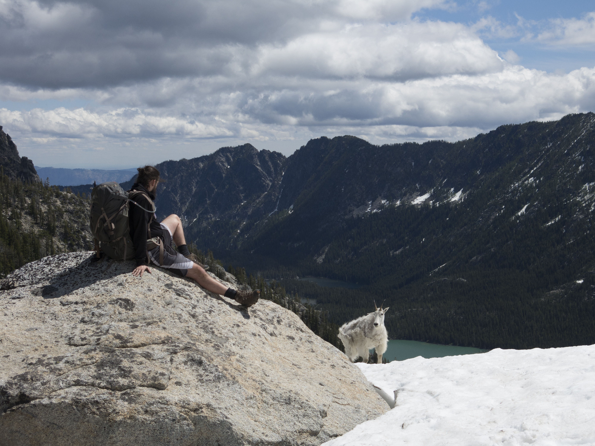

{:.avatar}

# Jesse Edgecombe
Aspiring Full-Stack Web Developer

<i class="fa fa-envelope"></i><a href="mailto:">Jesseedge@gmail.com</a>
|
<i class="fa fa-github"></i> <a href="https://github.com/JesseEdge">JesseEdge@github.com</a>
|
<i class="fa fa-linkedin"></i> <a href="https://www.linkedin.com/in/jesse-edgecombe-aa5572124/">JesseEdge@LinkedIn.com</a>

## Currently

I'm a graduate of University of Washington Tacoma and received my BA in psychology. Looking to transistion into the field of Web Development and find an entry level posistion at a start-up.

## Education

`2013-16`
__University of Washington Tacoma__ Bachelor's degree in Psychology

## Technical skills

* HTML and CSS
* Javascript and JQuery
* PHP
* Angular

## Projects

### CV

A list of projects I have worked on for my portfolio.

## Achievements

## Experience

## Hobbies

* Backpacking
* Reading
* Learning

## Links

* <i class="fa fa-envelope"></i> <a href="mailto:https://mail.google.com">Jesseedge@gmail.com</a> 
* <i class="fa fa-github"></i> <a href="https://github.com/JesseEdge">JesseEdge@github</a> 
* <i class="fa fa-linkedin"></i> <a href="https://www.linkedin.com/in/jesse-edgecombe-aa5572124/">Jesse Edgecombe's LinkedIn</a> 

